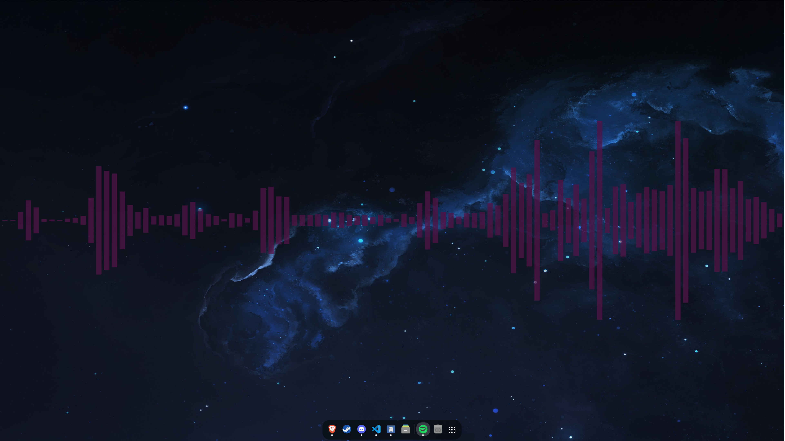

# conky-cava-visualizer

An audio visualizer made using Conky, Cava, Lua, and Cairo. No extra windows, just a cava visualizer on your desktop.

## Setup

1. Install [conky](https://github.com/brndnmtthws/conky) using the instructions provided in its repository.
2. Install [cava](https://github.com/karlstav/cava) using the instructions provided in its repository.
3. On this repository click `<> Code` and then `Download ZIP`.
4. Unzip the folder to your desired location. I recommend `~/.config/conky`.
5. Open a command line in the visualizer folder and run it using the command `conky -c ./visualizer.conf`.

## Configuration

Configuration options exist in both the conky and cava configuration files.

### visualizer.conf

The conky configuration file.

#### Height and Width

Set `minimum_height` and `minimum_width` to your desired visualizer size. I found that I also needed to reduce width by 8px when making it full screen, otherwise conky would not load the configuration.

#### Position

Set `gap_x` and `gap_y` to reposition the visualizer. DO NOT use non `_middle` alignments, doing so will break the visualizer lua script calculations.

#### Monitor

Set `xinerama_head` to the index of the monitor you want to display the visualizer on, starting with index 0.

### Cava config

The cava configuration file. Most options in this file are handled by cava itself. For those refer to the descriptions in file provided by the cava developers. Some additional options have been added or are used specifically by the conky visualizer lua script. You may also find the [cava example config file](https://github.com/karlstav/cava/blob/master/example_files/config) from its repository useful.

#### Orientation

[conky] orientation

NOT the cava orientation value, which has been removed from this file and must be left at its default value. Can be `top`, `bottom`, `horizontal`, `left`, `right`, or `vertical`. Defaults to `bottom`.

#### Color

[color] color

The visualizer bar color. Similar to the original cav foreground option. Must be a hex color.

#### Opacity

[color] opacity

The opacity of the bars. Must be a float between 0 and 1.